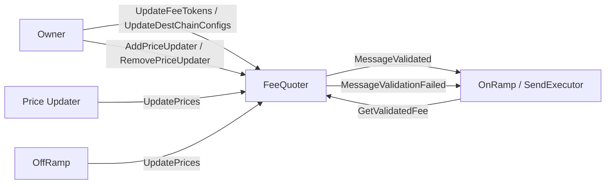
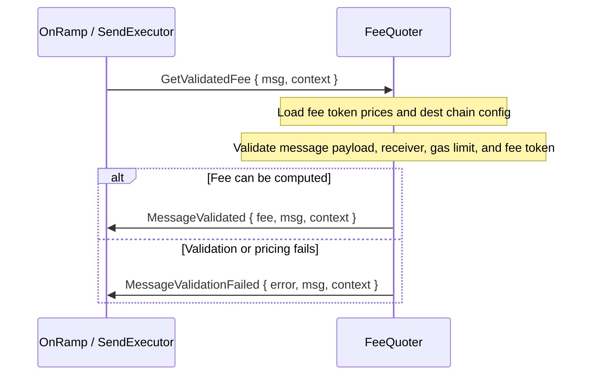

# FeeQuoter

The FeeQuoter is the CCIP pricing contract. It stores destination-chain fee configuration, fee token prices, premium multipliers, and the set of allowed price updaters. On the send path it validates a `CCIPSend` request and replies with either a computed fee or a validation error.

## Responsibilities

- Stores supported fee tokens and their premium multipliers.
- Stores destination-chain fee configuration used to price execution and data availability.
- Stores token prices and enforces staleness limits when computing fees.
- Validates message shape, receiver encoding, gas limits, and chain support before returning a fee.

## Main Flow

The implementation computes the final fee from execution cost, premium fee, and data availability cost, then converts it into the selected fee token before replying.