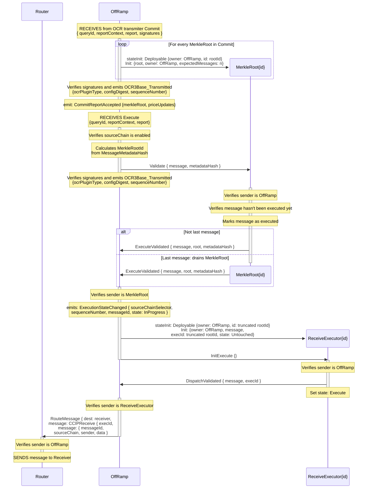
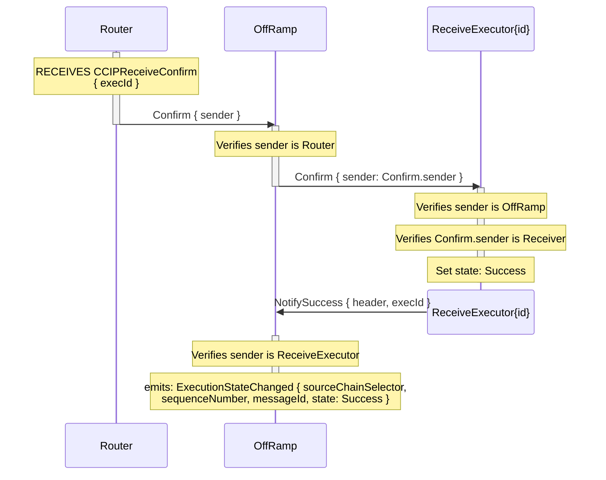
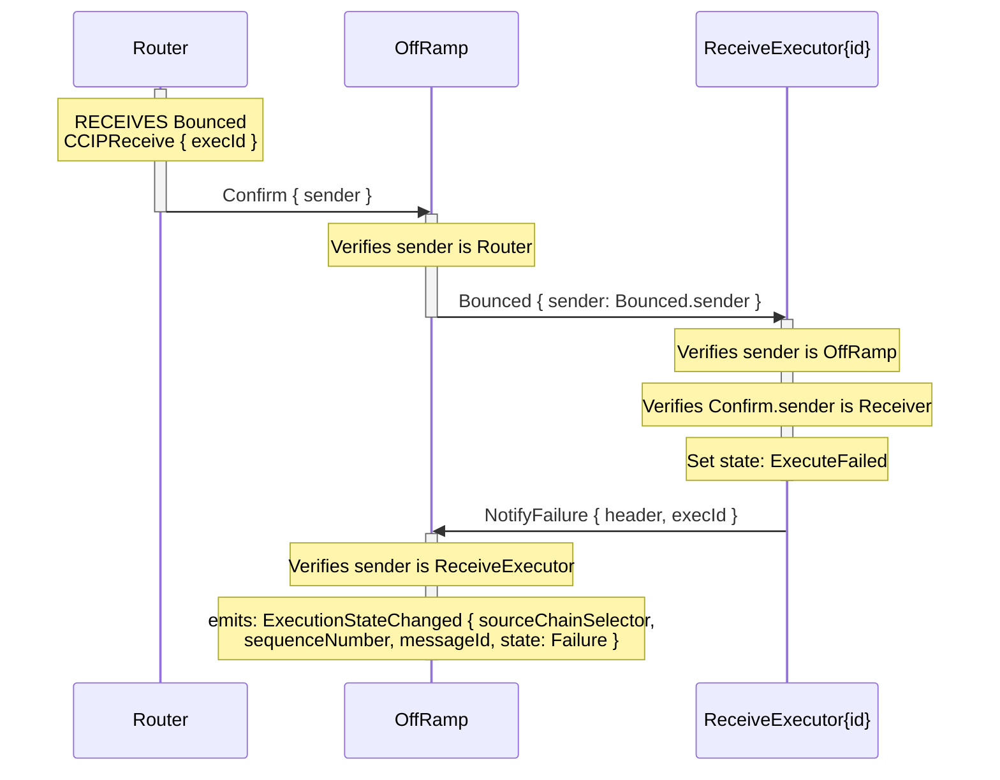

# Arbitrary Message OffRamp Flow

> See [how CCIPSend works](receive-executor.md) and [how the Token Registry is implemented](../../token-registry.md).

See [user interface](./user-interface.md) for more details on communication between User and Router.

## Receive Confirmation Flow

### Happy Path

### Failure Path

