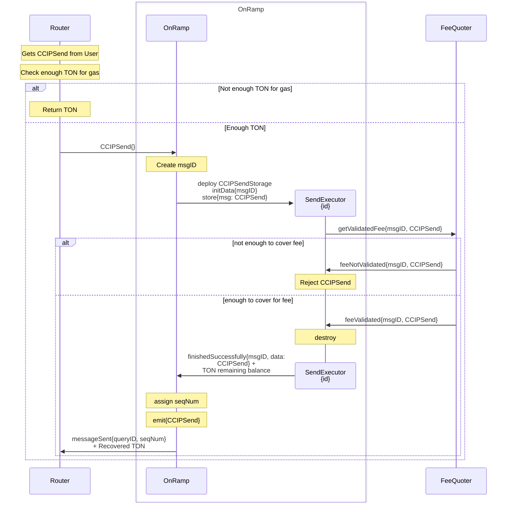
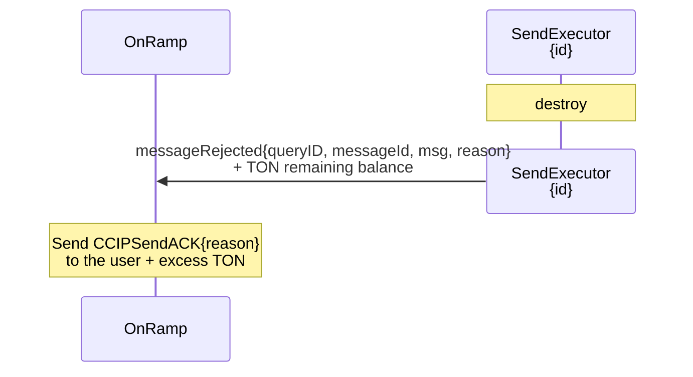

# Arbitrary Message Onramp Flow

> See [how CCIPSend works](send-executor.md) and [how the Token Registry is implemented](../../token-registry.md).

For any bounce we catch, or when we say Reject CCIPSend, it envolves:

