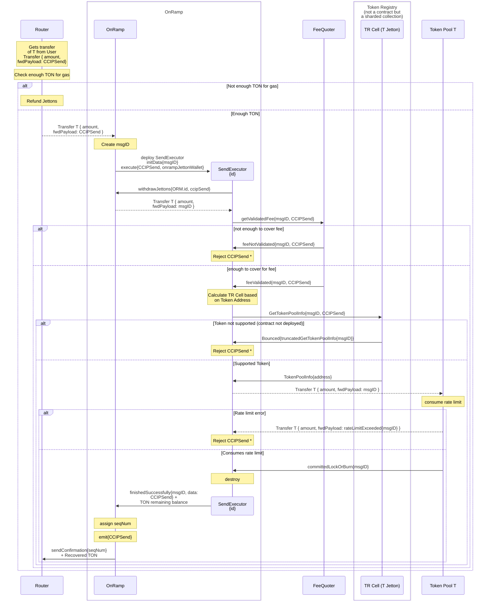
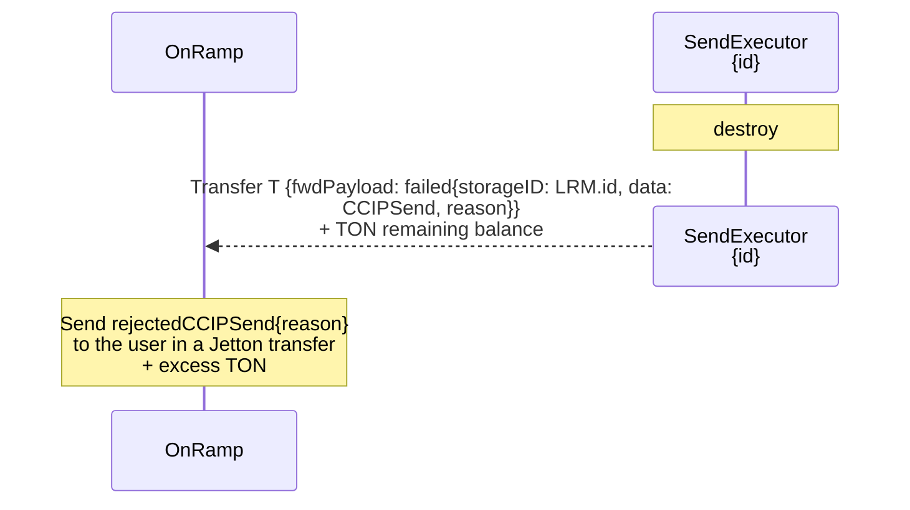

# Token Transfer Onramp Flow

> Before you read, see [Jetton Transfer Notation Convention](../token-transfer-notation-convention.md)

> See also [how CCIPSend works](../../onramp-ccipsend-executor.md) and [how the Token Registry is implemented](../../token-registry.md).

_The message flow for **Reject CCIPSend** is collapsed to a Note. You can find more details below._

For any bounce we catch, or every **Reject CCIPSend**, it envolves:

