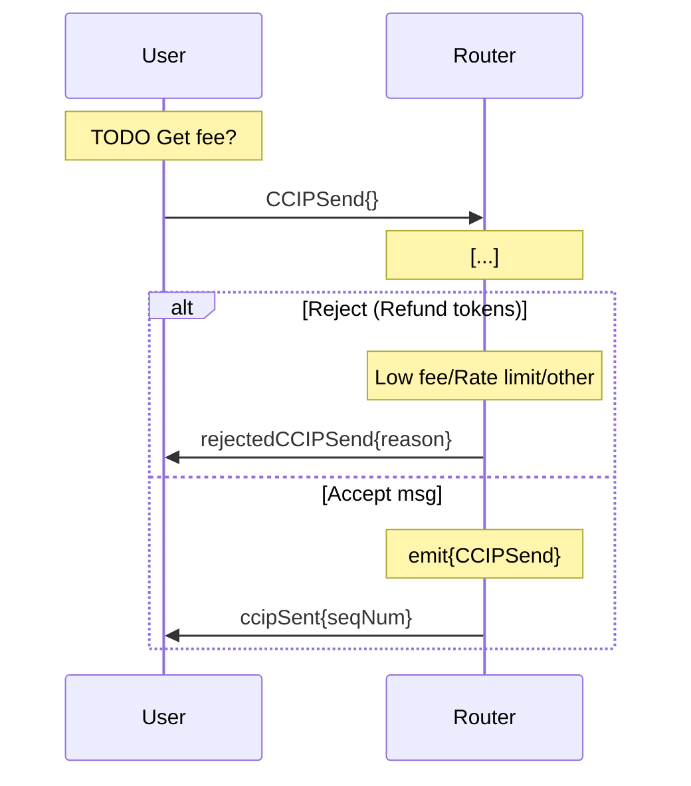
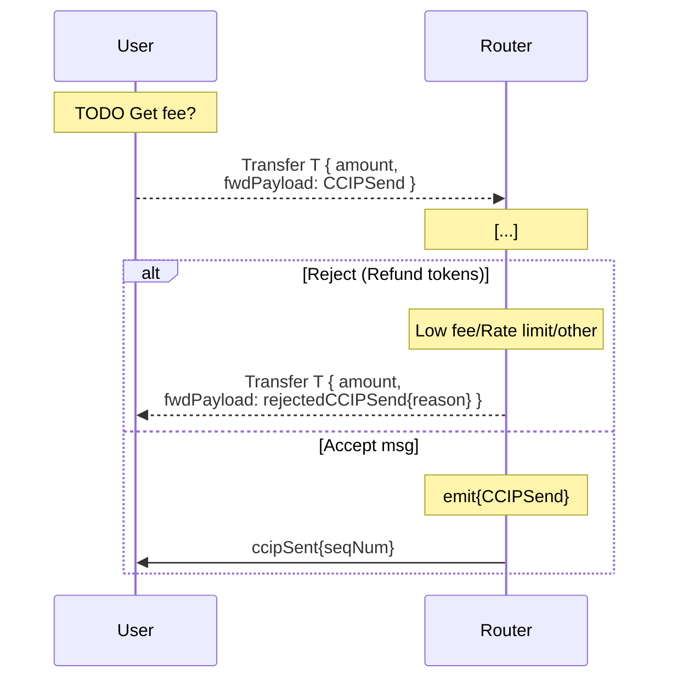

# OnRamp User Interface

For arbitrary messages paying fees in TON, the user interface is as follows:

For token transfers paid in TON, the user interface is as follows:

TODO: both paid with Link
