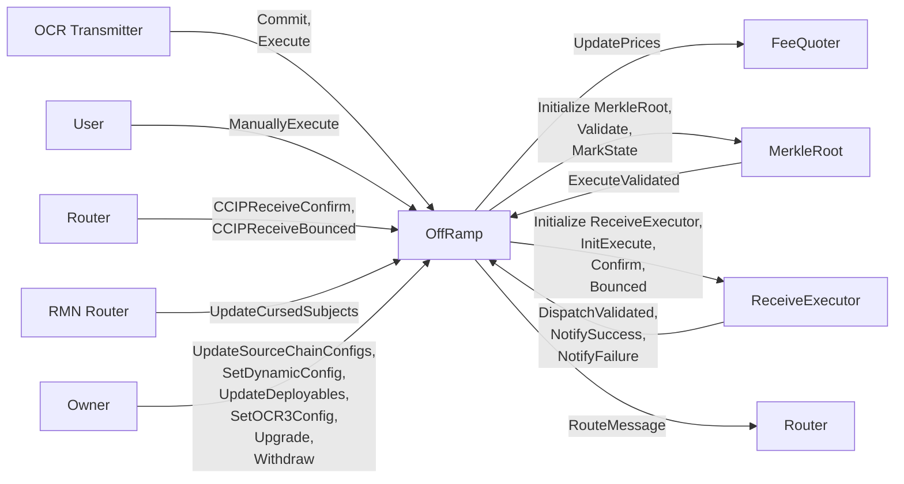

# Offramp

The offramp flow covers how validated CCIP messages are received, executed, and surfaced to destination contracts and applications.

## Relationship Diagram

## Topics

- [Arbitrary Message Flow](./arbitrary-msg.md)
- [MerkleRoot](./merkle-root.md)
- [ReceiveExecutor](./receive-executor.md)
- [Token Transfer Flow](./token-transfer.md)

## See also

- [Receiver User Interface](../router/user-interface/receiver.md)
