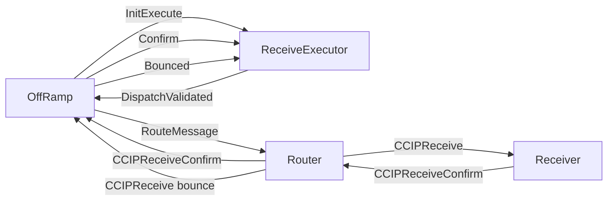
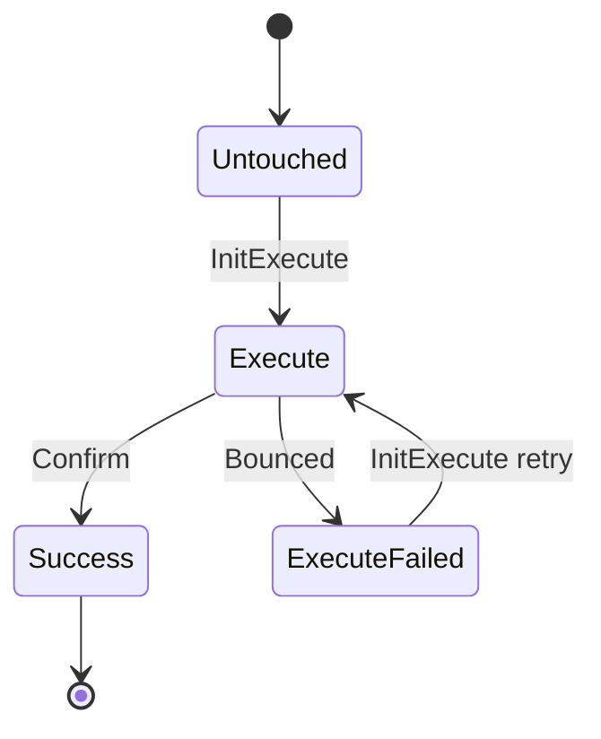

# ReceiveExecutor

The ReceiveExecutor is the execution-tracking contract used by the OffRamp to persist one incoming CCIP message at a deterministic address. It stores the message content, the root address, the execution id, the current message state, and the last execution timestamp.

The OffRamp deploys or reuses a ReceiveExecutor whenever a validated message is ready to be delivered to the receiver. From there, the ReceiveExecutor tracks whether the message is currently being executed, has failed, or has been confirmed successfully.

## State Machine

## Transition Rules

- `Untouched -> Execute`: the OffRamp sends `InitExecute`, which stores the current timestamp and forwards `DispatchValidated` back to the OffRamp.
- `Execute -> Success`: the Receiver confirms delivery through Router and OffRamp, and the OffRamp forwards `Confirm` to the ReceiveExecutor.
- `Execute -> ExecuteFailed`: the routed receive message bounces and the OffRamp forwards `Bounced` to the ReceiveExecutor.
- `ExecuteFailed -> Execute`: the same ReceiveExecutor can be retried on a later manual execution path.
- `Success` is terminal in practice because the contract returns its balance to the OffRamp and freezes.

This state is used together with [MerkleRoot](./merkle-root.md), which keeps the canonical per-message execution state for the whole committed root.

This serves to recover the message state in three situations:

1. When we get a bounced message from the receiver.
2. When the receiver confirms the execution.
3. When doing manual execution, validating the message was marked as failed.
