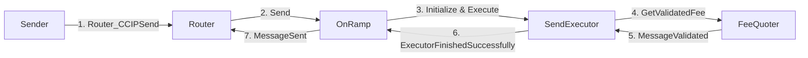
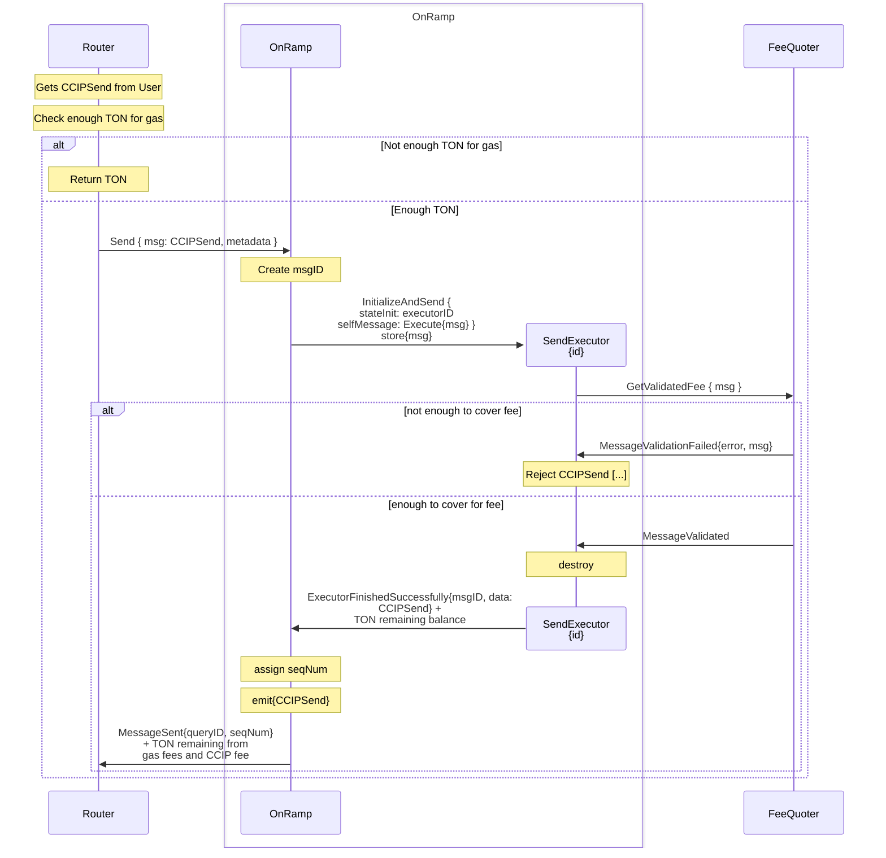
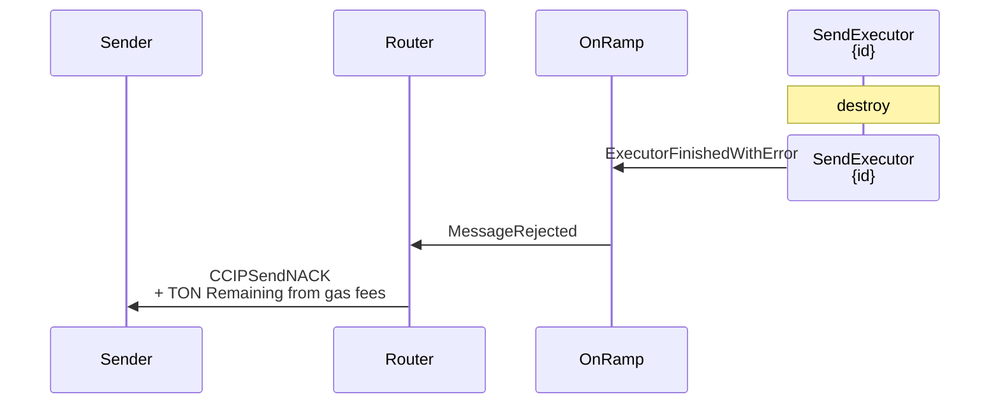

# Arbitrary Message Onramp Flow

> See [how CCIPSend works](send-executor.md) and [how the Token Registry is implemented](../token-registry.md).

For rejected sends or executor failures, the main notification path is:

