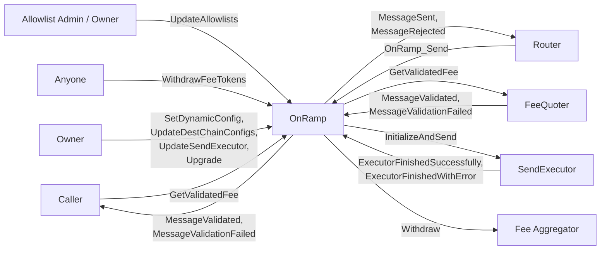

# Onramp

The onramp flow covers how CCIP send requests are accepted, stored, and prepared for downstream processing.

## Relationship Diagram

## Topics

- [Arbitrary Message Flow](./arbitrary-msg.md)
- [SendExecutor](./send-executor.md)
- [Token Transfer Flow](./token-transfer.md)

## See also

- [Sender User Interface](../router/user-interface/sender.md)
