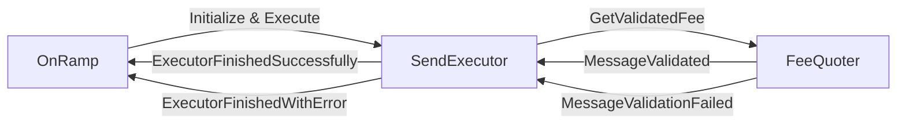
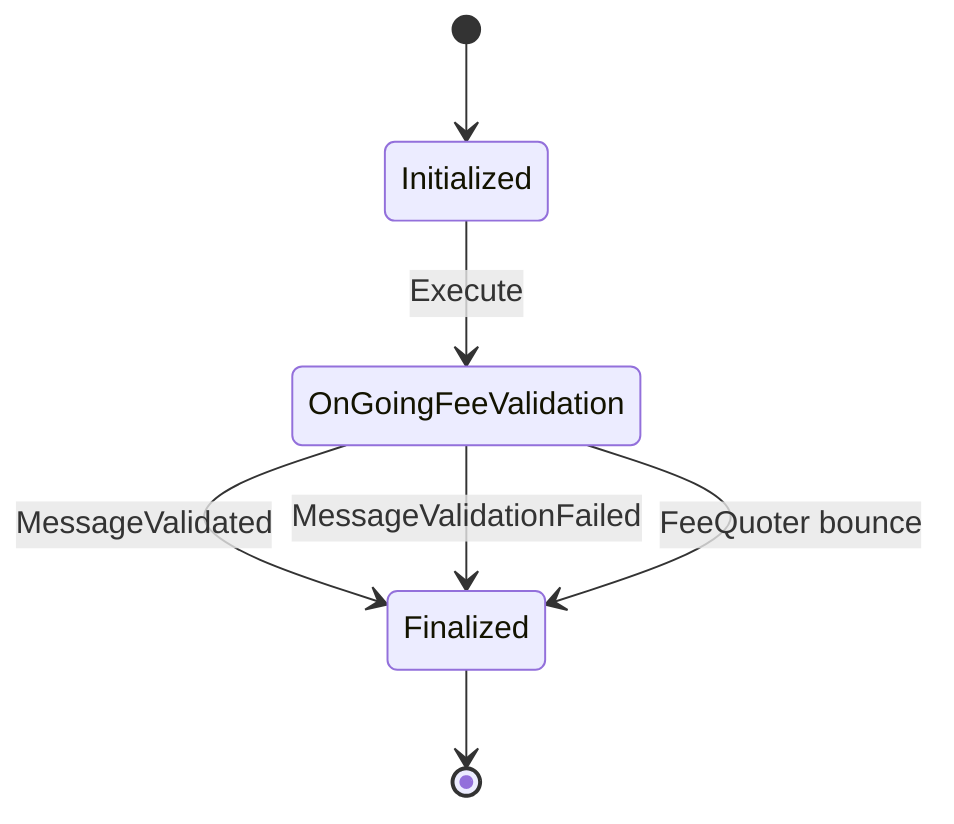

# SendExecutor

The SendExecutor is the per-message execution contract used by the OnRamp to process a single `CCIPSend` request. The OnRamp deploys a new SendExecutor for each outgoing message, and that contract owns the fee-validation roundtrip with FeeQuoter before reporting success or failure back to the OnRamp.

This is mainly useful because it keeps per-message execution isolated and lets the OnRamp recover the full send context when the pricing call succeeds, fails, or bounces.

## State Machine

## Transition Rules

- `Initialized -> OnGoingFeeValidation`: the executor receives `Execute`, loads the `CCIPSend` payload, and sends `GetValidatedFee` to FeeQuoter.
- `OnGoingFeeValidation -> Finalized` on success: after `MessageValidated`, the executor verifies the sender attached enough value to cover the CCIP fee and router costs, then reports `ExecutorFinishedSuccessfully` to the OnRamp.
- `OnGoingFeeValidation -> Finalized` on failure: if FeeQuoter returns `MessageValidationFailed`, or if the fee request bounces, the executor reports `ExecutorFinishedWithError` to the OnRamp.
- `Finalized` is terminal: the executor returns its remaining balance to the OnRamp and does not continue processing.

## Notes

1. When we get a bounced.
2. When we lockOrBurn tokens (as we won't be passing the whole ccipSend msg to the Token Pool).

This contract is initialized with an owner (the OnRamp) and an id that must fit in a bounced message (`uint224`). Its address is deterministic from that data, while the id itself is randomized for every message processed.
