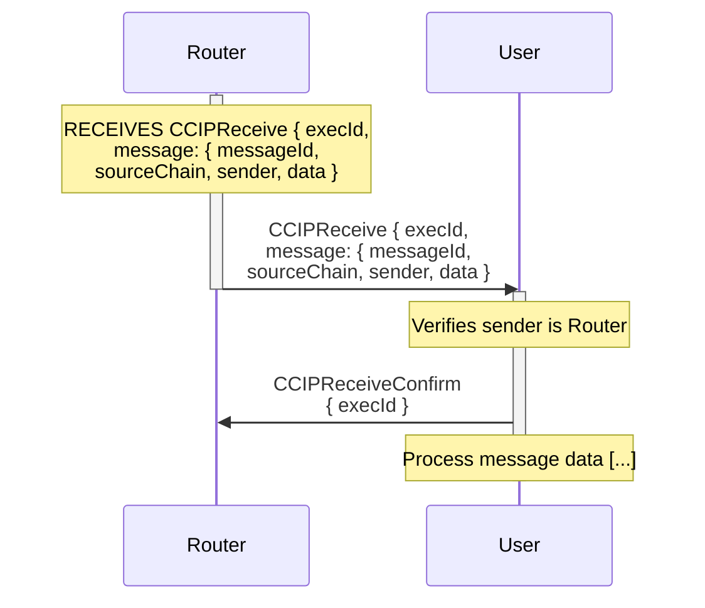
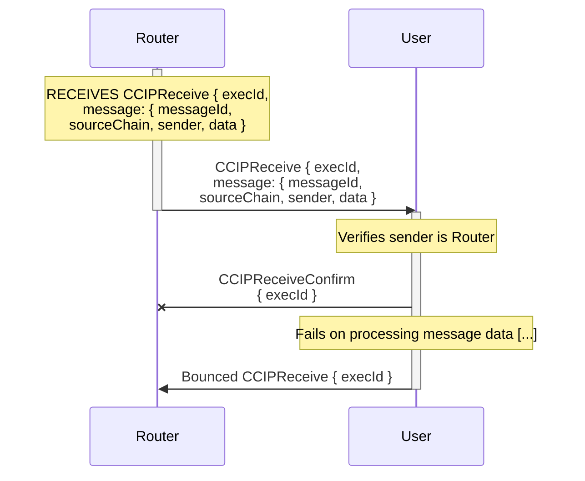

# Receiver User Interface

For arbitrary messages, the receiver must handle incoming `CCIPReceive` messages. On receiving such a message, the receiver should:

- Verify received TON is enough to cover gas costs.
- Verify the sender is the Router contract to ensure authenticity.
- Enqueue a `CCIPReceiveConfirm` message back to the Router, confirming receipt of the message.
- Process the message data as required by the application logic.

## Happy Path

## Failure Path

