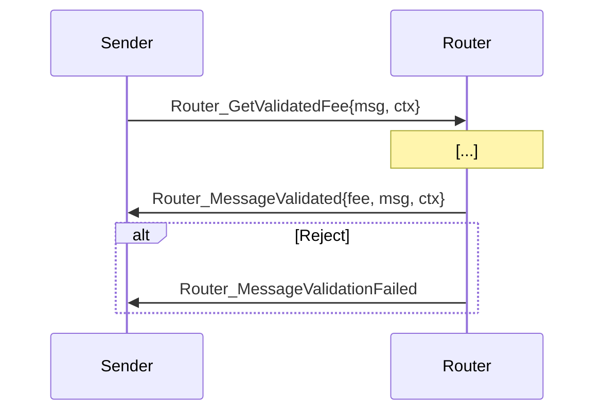
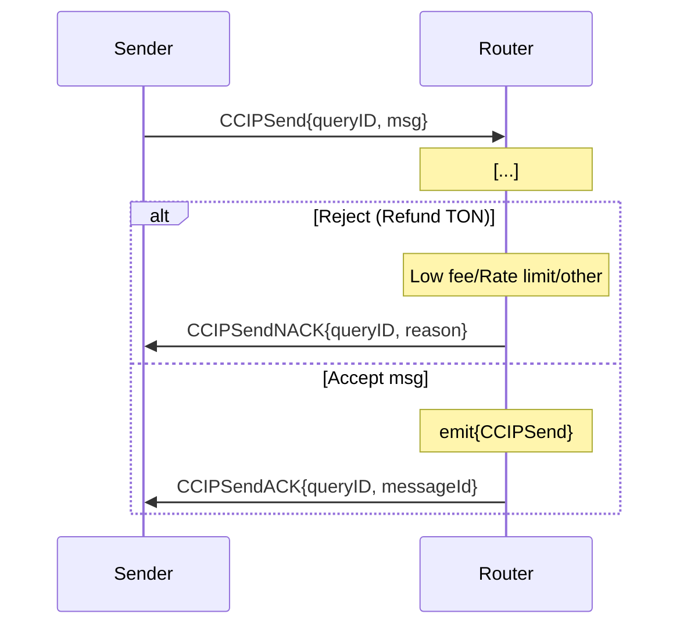
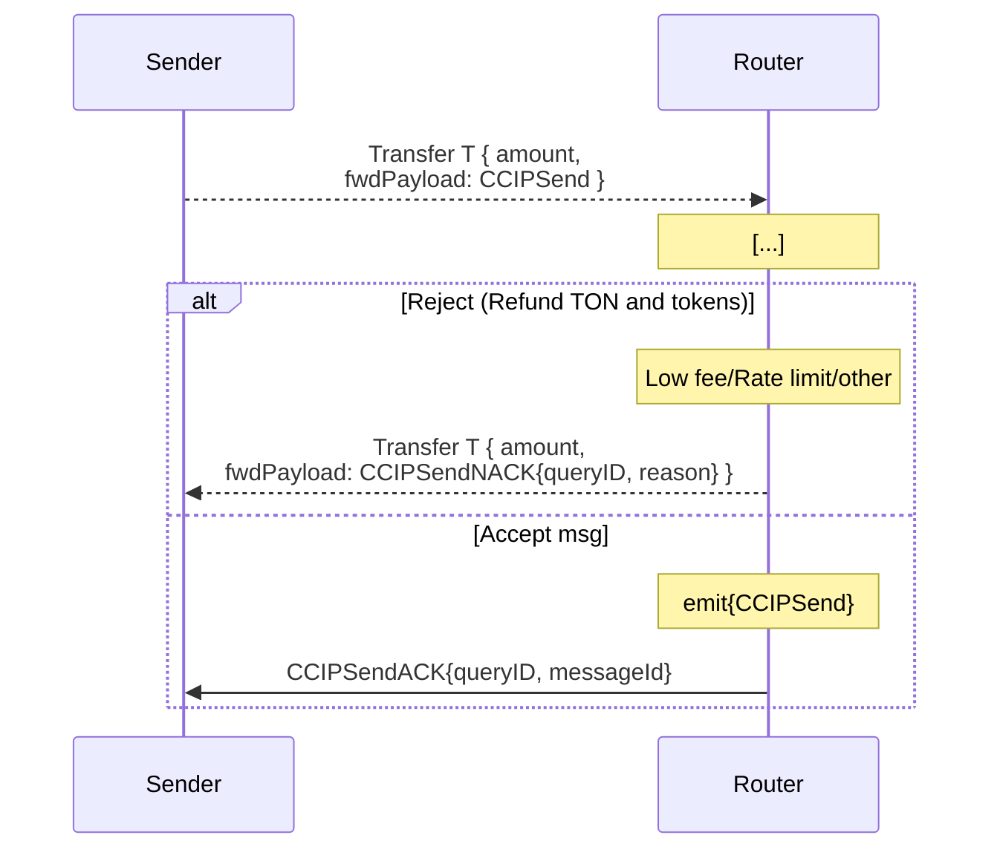

# Sender User Interface

The user can request the fee on-chain for a message before sending it by calling `Router_GetValidatedFee` on the Router. The user will then receive a `Router_MessageValidated` or a `Router_MessageValidationFailed` callback.


 
The `context` field allows the user to correlate the response with the request. It can be used to store any information the user wants, and it will be passed back in the callback.

The fee can also be requested off-chain.

```ts
  const routerContract = blockchain.openContract(rt.Router.createFromAddress(router))
  const orAddress = await routerContract.getOnRamp(msg.destChainSelector)
  const onRampContract = blockchain.openContract(onr.OnRamp.createFromAddress(orAddress))
  const feeQuoterAddress = await onRampContract.getFeeQuoter(msg.destChainSelector)
  const feeQuoterContract = blockchain.openContract(
    fq.FeeQuoter.createFromAddress(feeQuoterAddress),
  )
  const fee = await feeQuoterContract.getValidatedFee(msg)
  return fee
```

1. Router `onRamp(destChainSelector: uint64)` getter => OnRamp address
2. OnRamp `feeQuoter(destChainSelector: uint64)` getter => FeeQuoter address
3. FeeQuoter `validatedFee(msg: Cell<Router_CCIPSend>)` getter => fee

> [!NOTE] The returned fee only accounts for the CCIP Fee. The user should add extra TON for execution gas and forward fees on top of it to avoid having their message rejected for insufficient fee.

Alternatively, the user can just send the message with an optimistic amount of TON. In this case, the Router will validate the message and either accept it or reject it. 

In the case the message is accepted, the user will receive a `CCIPSendACK` back with the TON that was left from gas fees and the CCIP Fee. If the message is rejected, the user will receive a `CCIPSendNACK` with the TON left from the gas fees. No CCIP Fee is charged if the message is rejected.

For arbitrary messages paying fees in TON, the user interface is as follows:



For token transfers paid in TON (Not yet supported), the user interface is as follows:



<!-- TODO: flow for paying with Link -->
