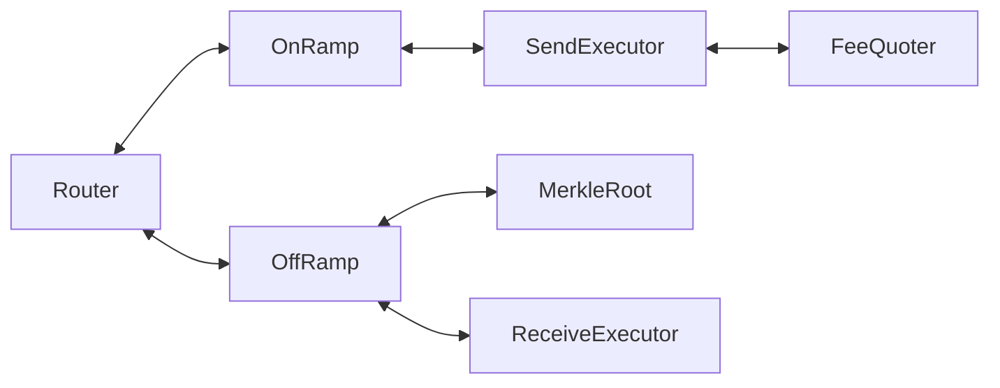

# CCIP

This section documents the TON-specific CCIP contract design, including the token registry and the message flow across onramp and offramp components.

## Contract Interaction

## Contracts Reference

- [Router](./router/index.md)
- [OnRamp](./onramp/index.md)
  - [Send Executor](./onramp/send-executor.md)
- [OffRamp](./offramp/index.md)
  - [Receive Executor](./offramp/receive-executor.md)
  - [Merkle Root](./offramp/merkle-root.md)
- [FeeQuoter](./fee-quoter.md)
- [Token Pools](./token-pools/index.md)

## Topics

- [Flow Overview](./flow.md)
- [Token Transfer Notation Convention](./token-transfer-notation-convention.md)
