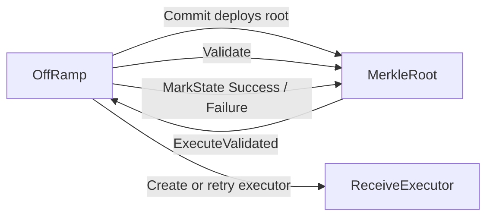
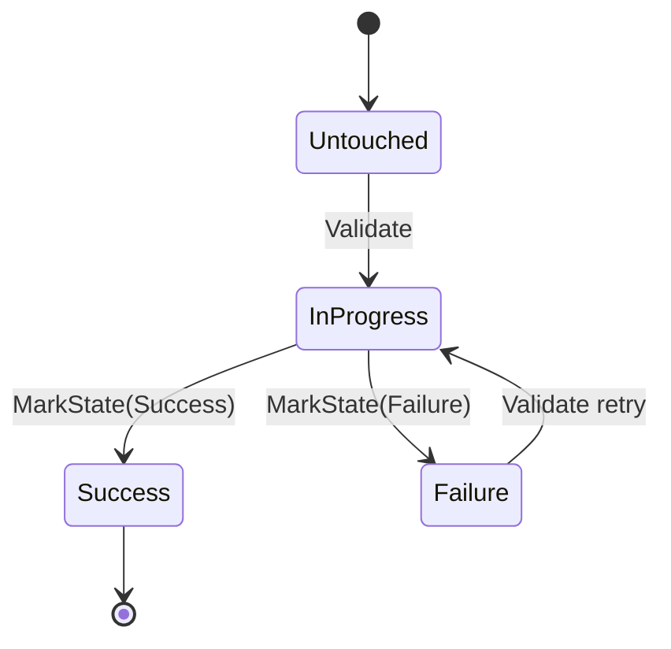
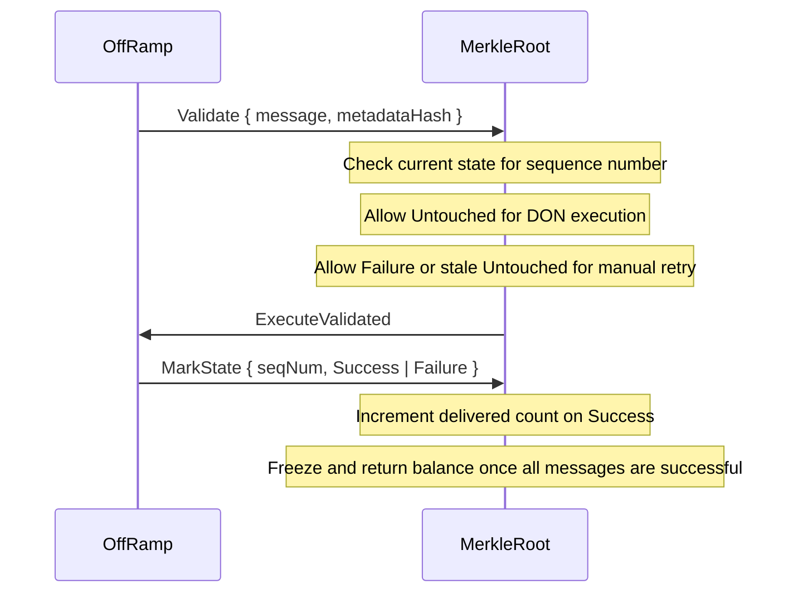

# MerkleRoot

The MerkleRoot contract is deployed once per committed root. It tracks execution state for every message sequence number covered by that root and acts as the gatekeeper for retries. The OffRamp uses it to prove that a message belongs to a committed report before creating or reusing a `ReceiveExecutor`.

Each message state is stored in a packed two-bit bitmap keyed by sequence number offset. A single MerkleRoot can track up to 64 messages.

## State Machine

The state machine is per message, not per contract.

## Transition Rules

- `Untouched -> InProgress`: the OffRamp sends `Validate` after checking the execute report. Normal DON execution is only allowed from `Untouched`.
- `InProgress -> Success`: the OffRamp calls `MarkState(Success)` after the `ReceiveExecutor` confirms delivery.
- `InProgress -> Failure`: the OffRamp calls `MarkState(Failure)` after a bounced delivery or failed execution path.
- `Failure -> InProgress`: a retry is allowed when execution previously failed. Manual execution can also retry an old untouched message once the permissionless threshold has passed.
- `Success` is terminal: the contract rejects any later transition away from success.

## Root Lifecycle

The root only freezes when every message in its interval has eventually reached `Success`. Failed messages keep the root alive so they can be retried.