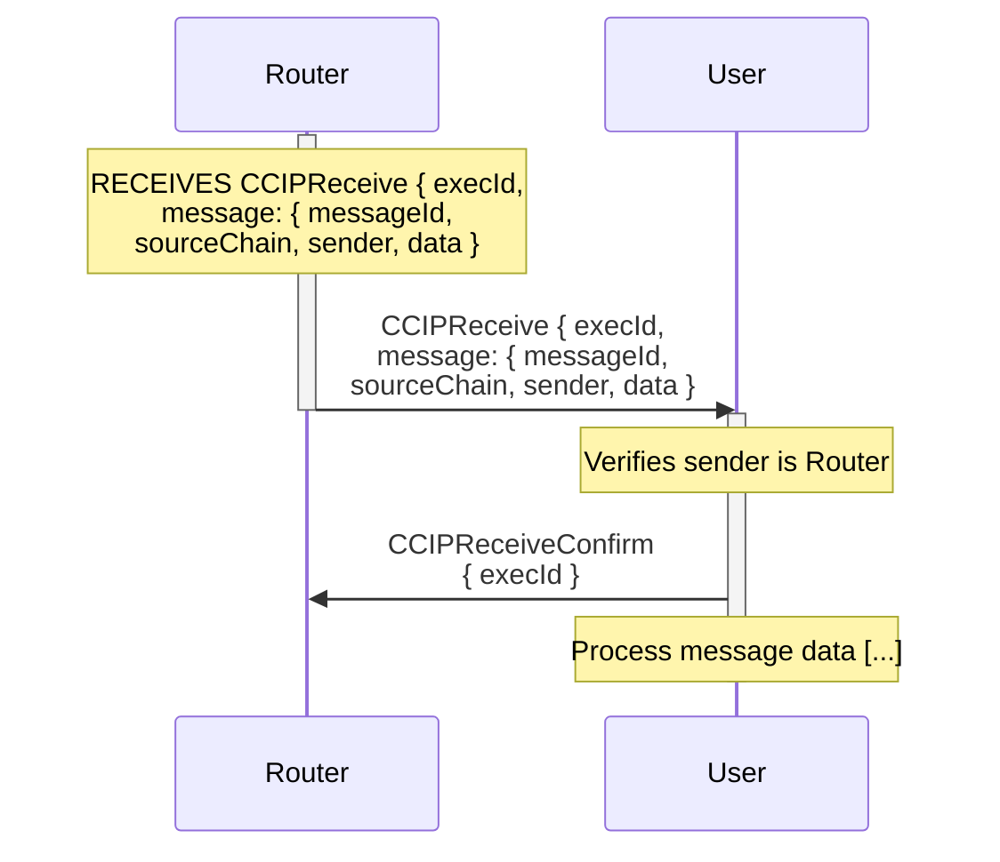
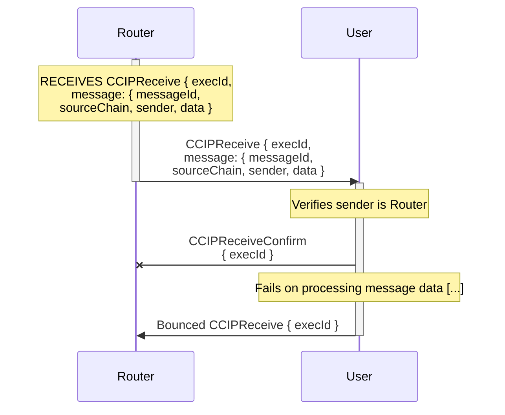

# Receiver User Interface

For arbitrary messages, the receiver must handle incoming `CCIPReceive` messages. On receiving such a message, the receiver should:

- Verify received TON is enough to cover gas costs.
- Verify the sender is the Router contract to ensure authenticity.
- Enqueue a `CCIPReceiveConfirm` message back to the Router, confirming receipt of the message.
- Process the message data as required by the application logic.

## Happy Path

## Failure Path

## Messages Stuck In-Progress  

Messages can get stuck in an "In Progress" state for two reasons:

- Successful delivery but no confirmation: The receiver got the message and processed it successfully but failed to send the `CCIPReceiveConfirm` back to the Router, leaving the message in an "In Progress" state until the Router times out the message. This is bad practice and can lead to confused users using ccip explorer.
- Fail to deliver message and no bounce: If the gas limit is too low, the message may not be delivered to the receiver, or the receiver might ran ouf of gas during validation, and there will be no gas left to send the bounce message back to the Router, leaving the message in an "In Progress". In this situation, the message will never be enabled for manual execution and will be stuck forever. To avoid this, the sender should use a gas limit that is high enough to cover the worst case scenario.
