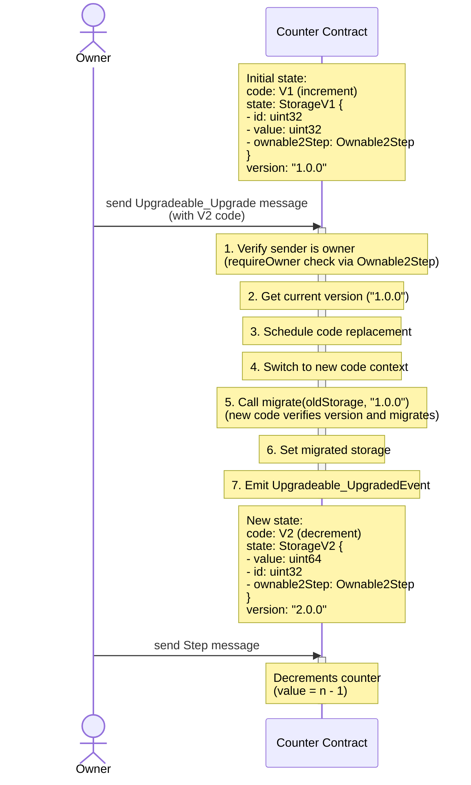

# Chainlink TON - Contract upgradability - Upgradeable

This module implements the ability for a contract to upgrade its code and migrate its storage layout from one version to another.

[An upgradeable counter example can be found here.](../../../../contracts/contracts/examples/upgrades/)

## Interface

### Provides

The `Upgradeable` struct provides message handling for upgrade operations:

```tolk
struct Upgradeable {
    /// Points to the storage migration function.
    /// Receives the old storage cell and the version string of the contract being upgraded from.
    /// Verifies the version is supported and returns the migrated storage cell.
    /// Must have @method_id(1000) and be consistent across versions.
    migrate: (cell, slice) -> cell;
    
    /// Points to the version function.
    /// Returns the current version of the contract as a string.
    /// Must have @method_id(1001) and be consistent across versions.
    version: () -> slice;
}
```

Handles `Upgradeable_Upgrade` message of type:

```tolk
/// Message for upgrading a contract.
/// crc32("Upgradeable_Upgrade") == 0x0aa811ed
struct (0x0aa811ed) Upgradeable_Upgrade {
    queryId: uint64;
    code: cell;
}
```

The upgrade mechanism ensures that upgrades are performed from the expected version by passing the current version to the `migrate` function, preventing accidental upgrades from intermediate or incorrect versions.

Emits an `UpgradedEvent` upon successful upgrade:

```tolk
struct Upgradeable_UpgradedEvent {
    /// The new code of the contract.
    code: cell;
    /// The SHA256 hash of the new code.
    hash: uint256;
    /// The version of the contract after the upgrade.
    version: UnsafeBodyNoRef<slice>;
}
```

Event topic: `0xa33b498e` (crc32("Upgradeable_UpgradedEvent"))

### Error Codes

The module defines the following error codes:

```tolk
enum Upgradeable_Error {
    VersionMismatch = 28700; // Thrown when the version passed to migrate doesn't match expected version
}
```

### Requirements

Required method implementations in your contract:

```tolk
/// Storage migration function with method_id(1000)
@method_id(1000)
fun migrate(storage: cell, version: slice): cell { 
    // Verify the version matches expected previous version
    assert (version.bitsEqual("1.0.0")) throw Upgradeable_Error.VersionMismatch;
    
    // Implement storage migration logic here
    // Parse old storage, transform it, return new storage
}

/// Version function with method_id(1001)  
@method_id(1001)
fun version(): slice { 
    return "2.0.0"; // Your contract version
}
```

## Storage Migration

The upgrade mechanism allows for storage layout changes between contract versions. Each contract version must implement a `migrate` function that converts the previous version's storage format to the current version's format.

The `migrate` function receives two parameters:

- `storage: cell` - The storage cell from the previous version
- `version: slice` - The version string of the contract being upgraded from

This allows the new version to verify it's upgrading from the expected version and handle multiple upgrade paths if needed.

### Example Implementation

**Version 1 Storage:**

```tolk
struct StorageV1 {
    id: uint32;
    value: uint32;
    ownable2Step: Ownable2Step;
}
```

**Version 2 Storage:**

```tolk
struct StorageV2 {
    value: uint64;  // Changed from uint32 to uint64
    id: uint32;
    ownable2Step: Ownable2Step;
}
```

**Migration Implementation (V2):**

```tolk
const COUNTER_V1_CONTRACT_VERSION = "1.0.0";

@method_id(1000)
fun migrate(storage: cell, version: slice): cell {
    // Verify we're upgrading from V1
    assert (version.bitsEqual(COUNTER_V1_CONTRACT_VERSION)) throw Upgradeable_Error.VersionMismatch;
    
    // Parse the old storage format
    var oldStorage = StorageV1.fromCell(storage);
    
    // Create new storage with migrated data
    var newStorage = StorageV2{
        value: oldStorage.value as uint64,  // Convert uint32 to uint64
        id: oldStorage.id,
        ownable2Step: oldStorage.ownable2Step,  // Keep ownership unchanged
    };
    
    return newStorage.toCell();
}

@method_id(1001)
fun version(): slice { 
    return "2.0.0"; 
}
```

## Contract Integration

To integrate the Upgradeable module into your contract:

1. **Include the module in your message handler:**

```tolk
fun onInternalMessage(in: InMessage) {
    if (in.body.isEmpty()) { // ignore all empty messages
        return;
    }

    val sender = in.senderAddress;
    var storage = loadData();
    var handled = storage.ownable2Step.onInternalMessage(sender, in.body);

    if (handled) {
        saveData(storage);
        return;
    }

    val msg = IncomingMessage.fromSlice(in.body);

    match (msg) {
        Upgradeable_Upgrade => {
            // Authorization is up to the contract developer
            storage.ownable2Step.requireOwner(sender);
            Upgradeable{ migrate, version }.upgrade(msg);
        }
        // Handle your contract's custom messages
        // ...
    }
}
```

1. **Implement required methods:**

```tolk
@method_id(1000)
fun migrate(storage: cell, version: slice): cell {
    // Your migration logic
}

@method_id(1001)
fun version(): slice { 
    return "2.0.0"; 
}
```

## Upgrade Flow

The upgrade process includes version verification to ensure upgrades are performed from the expected version:



### Version Mismatch Protection

The upgrade mechanism includes built-in protection against incorrect version upgrades. The new contract's `migrate` function verifies it's upgrading from the expected version:

```typescript
// ✅ Correct: V2's migrate function will accept version "1.0.0"
await contract.sendUpgrade(owner.getSender(), toNano('0.05'), {
  queryId: 0n,
  code: v2Code, // V2 code expects to upgrade from "1.0.0"
})

// ❌ Incorrect: Will fail with exit code 28700 (VersionMismatch)
// If you try to upgrade a V2 contract with V3 code that expects V1
await v2Contract.sendUpgrade(owner.getSender(), toNano('0.05'), {
  queryId: 0n,
  code: v3Code, // V3's migrate expects "1.0.0" but contract is "2.0.0"
})
```

The version check happens inside the new contract's `migrate` function:

```tolk
@method_id(1000)
fun migrate(storage: cell, version: slice): cell {
    // This will throw VersionMismatch if version != "1.0.0"
    assert (version.bitsEqual("1.0.0")) throw Upgradeable_Error.VersionMismatch;
    // ... rest of migration logic
}
```

This prevents scenarios where:

- A contract is upgraded from an unexpected intermediate version
- Multiple upgrade transactions are sent simultaneously
- An old upgrade transaction is replayed after a newer upgrade has completed

## Testing Upgradeable Contracts

The framework provides two reusable test specifications for upgradeable contracts:

1. **`newUpgradeSpec`**: Tests the upgrade process from a previous version to a current version
2. **`newCurrentVersionSpec`**: Tests the current version's upgradeable interface without going through the upgrade process

This separation allows you to test the upgrade path separately from the current version's behavior, avoiding unnecessary setup when you only need to test the current version.

### Testing Upgrade Process

Use `newUpgradeSpec` to test that upgrades work correctly from a previous version to the current version:

```typescript
import { newUpgradeSpec } from '../../../wrappers/libraries/upgrades/UpgradeableSpec'
import { UpgradeableCounterV1 } from '../../../wrappers/examples/upgrades/UpgradeableCounterV1'
import { UpgradeableCounterV2 } from '../../../wrappers/examples/upgrades/UpgradeableCounterV2'

describe('UpgradeableCounter - Upgrade Tests', () => {
  const upgradeSpec = newUpgradeSpec(
    {
      contractType: UpgradeableCounterV1.type(),
      prevVersion: UpgradeableCounterV1.version(),
      currentVersion: UpgradeableCounterV2.version(),
      getPrevCode: () => UpgradeableCounterV1.code(),
      getCurrentCode: () => UpgradeableCounterV2.code(),
      CurrentVersionConstructor: UpgradeableCounterV2,
      upgradeValue: toNano('0.05'), // Optional: defaults to 0.05 TON
    },
    async (blockchain, owner) => {
      // Setup function: deploy your previous version contract
      const code = await UpgradeableCounterV1.code()
      const contract = blockchain.openContract(
        UpgradeableCounterV1.createFromConfig(
          {
            id: 0,
            value: 0,
            ownable: { owner: owner.address, pendingOwner: null },
          },
          code,
        ),
      )
      const deployer = await blockchain.treasury('deployer')
      await contract.sendDeploy(deployer.getSender(), toNano('0.05'))
      return contract
    },
  )

  upgradeSpec.run()
})
```

#### Upgrade Test Coverage

The upgrade test spec provides the following test cases:

1. **should deploy on correct version**: Verifies that the previous version contract deploys with the correct version, type, code, and code hash
2. **should upgrade from previous to current version**: Tests the complete upgrade flow, including:
   - Version verification before and after upgrade
   - Code and code hash verification
   - Storage migration (the new version's `migrate` function processes the old version's data)
   - Upgrade event emission with correct version, code, and code hash

### Testing Current Version

Use `newCurrentVersionSpec` to test the current version's upgradeable interface directly:

```typescript
import { newCurrentVersionSpec } from '../../../wrappers/libraries/upgrades/UpgradeableSpec'
import { UpgradeableCounterV2 } from '../../../wrappers/examples/upgrades/UpgradeableCounterV2'

describe('UpgradeableCounter - Current Version Tests', () => {
  const currentVersionSpec = newCurrentVersionSpec(
    {
      contractType: UpgradeableCounterV2.type(),
      currentVersion: UpgradeableCounterV2.version(),
      getCurrentCode: () => UpgradeableCounterV2.code(),
      CurrentVersionConstructor: UpgradeableCounterV2,
      upgradeValue: toNano('0.05'), // Optional: defaults to 0.05 TON
    },
    async (blockchain, owner) => {
      // Setup function: deploy your current version contract directly
      const code = await UpgradeableCounterV2.code()
      const contract = blockchain.openContract(
        UpgradeableCounterV2.createFromConfig(
          {
            id: 0,
            value: 0,
            ownable: { owner: owner.address, pendingOwner: null },
          },
          code,
        ),
      )
      const deployer = await blockchain.treasury('deployer')
      await contract.sendDeploy(deployer.getSender(), toNano('0.05'))
      return contract
    },
  )

  currentVersionSpec.run()

  // Add your contract-specific tests
  it('should decrement counter', async () => {
    // Your custom test logic
  })
})
```

#### Current Version Test Coverage

The current version test spec provides the following test cases:

1. **should deploy on correct version**: Verifies that the contract deploys with the correct version, type, code, and code hash
2. **should fail when non-owner tries to upgrade**: Ensures that only the owner can perform upgrades
3. **should fail when fromVersion does not match current version**: Verifies that upgrades fail with exit code 28700 when the new contract's `migrate` function rejects the current version

### Configuration Options

#### UpgradeTestConfig

For `newUpgradeSpec`, accepts the following parameters:

- `contractType`: The expected contract type name (e.g., from `YourContract.type()`)
- `prevVersion`: Version string for the previous version contract (e.g., from `YourContractV1.version()`)
- `currentVersion`: Version string for the current version contract (e.g., from `YourContractV2.version()`)
- `getPrevCode`: Function to get the code for the previous version contract
- `getCurrentCode`: Function to get the code for the current version contract
- `CurrentVersionConstructor`: Constructor class for the current version contract
- `upgradeValue` (optional): Amount of TON to use for upgrade transactions (defaults to 0.05 TON)

#### CurrentVersionTestConfig

For `newCurrentVersionSpec`, accepts the following parameters:

- `contractType`: The expected contract type name (e.g., from `YourContract.type()`)
- `currentVersion`: Version string for the current version contract (e.g., from `YourContractV2.version()`)
- `getCurrentCode`: Function to get the code for the current version contract
- `CurrentVersionConstructor`: Constructor class for the current version contract
- `upgradeValue` (optional): Amount of TON to use for upgrade transactions (defaults to 0.05 TON)

### Benefits

- **Separation of Concerns**: Test upgrade process separately from current version behavior
- **Efficiency**: Skip upgrade setup when testing current version features
- **Consistency**: All upgradeable contracts are tested the same way
- **Maintainability**: Bug fixes and improvements to upgrade testing are automatically applied to all contracts
- **Focus**: Allows you to focus on testing contract-specific functionality
- **Type Safety**: Properly typed with `SandboxContract<UpgradeableContract>` for full TypeScript support
