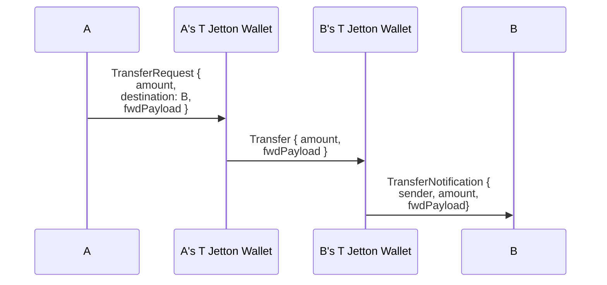
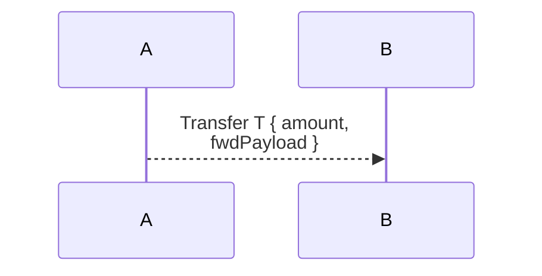

# Token Transfer Notation Convention

This is a convention we will be using for our diagrams. Given to actors **A** and **B** where **A** transfer `T` Jettons to **B**, the real message flow looks like this:

To reduce noice, we will represent this flow with a doted line arrow

We must remember that we cannot get bounced from this transfers, and that they envolve 3 hops, so they add latency and foward fee costs.
