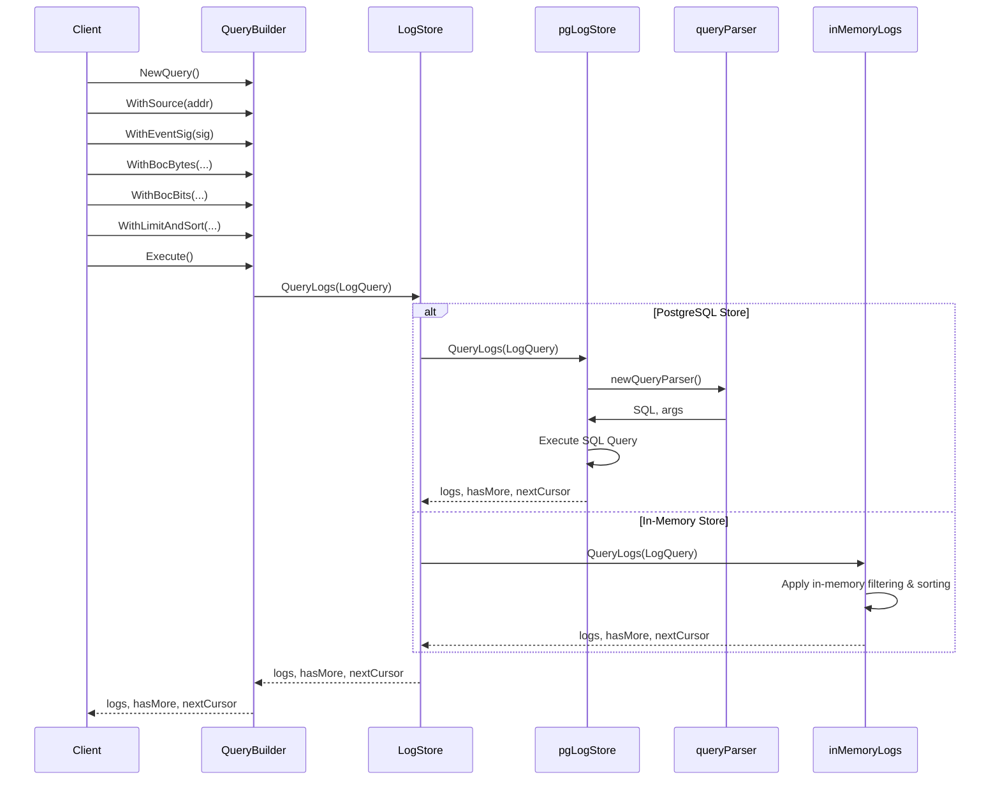

# TON Logpoller Query Interface

## Query Flow



## TON Specific Features

### Filter Types
- **Byte Filter**: Filter on specific byte values in BOC-encoded data
- **Bit Filter**: Filter on bit-level patterns within data
- **Field Filter**: Filter on structured fields (timestamp, block height, etc.)

### Usage Examples

```go
// Byte filtering on BOC data
logs, hasMore, nextCursor, err := service.NewQuery().
    WithSource(contractAddr).
    WithEventSig(eventSig).
    WithBocBytes(
        query.SkipBytes(4),                                     // Skip header
        query.MatchBytes(32, query.WithCondition(value, primitives.Eq)), // Filter 32-byte value
    ).
    Execute(ctx)

// Field filtering
logs, hasMore, nextCursor, err := service.NewQuery().
    WithFields(query.Timestamp(ts, primitives.Gte)).           // Timestamp filter
    Execute(ctx)

// Bit filtering
logs, hasMore, nextCursor, err := service.NewQuery().
    WithSource(contractAddr).
    WithBocBits(
        query.SkipBits(32),                                    // Skip 32 bits
        query.MatchBit(true),                                  // Match single bit
        query.MatchBits([]byte{0xFF}),                        // Match bit pattern
    ).
    Execute(ctx)

// Combined filtering
logs, hasMore, nextCursor, err := service.NewQuery().
    WithSource(contractAddr).
    WithEventSig(eventSig).
    WithFields(query.Timestamp(ts, primitives.Gte)).
    WithBocBytes(query.SkipBytes(4), query.MatchBytes(8, query.WithCondition(data, primitives.Eq))).
    WithLimitAndSort(commonquery.LimitAndSort{Limit: 100}).
    Execute(ctx)
```
